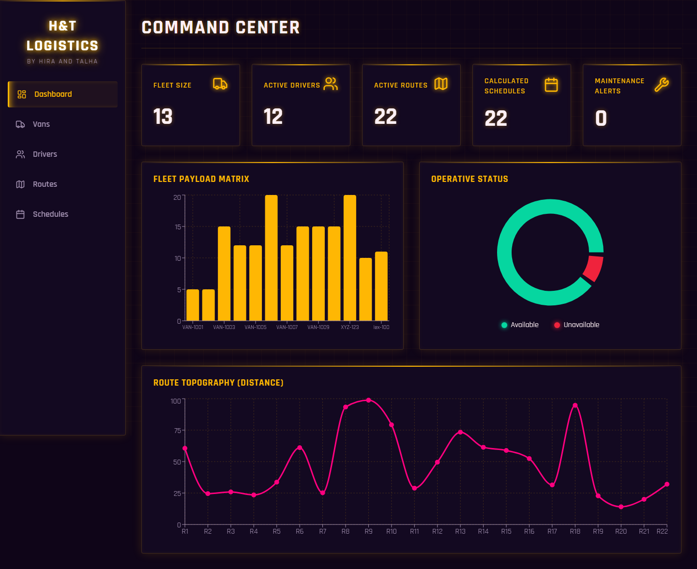
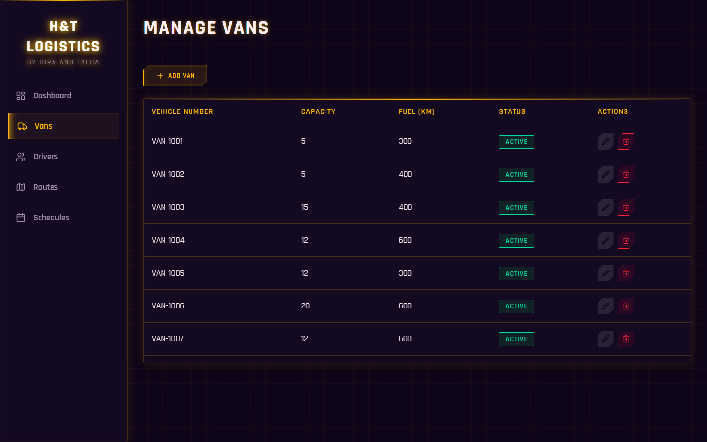
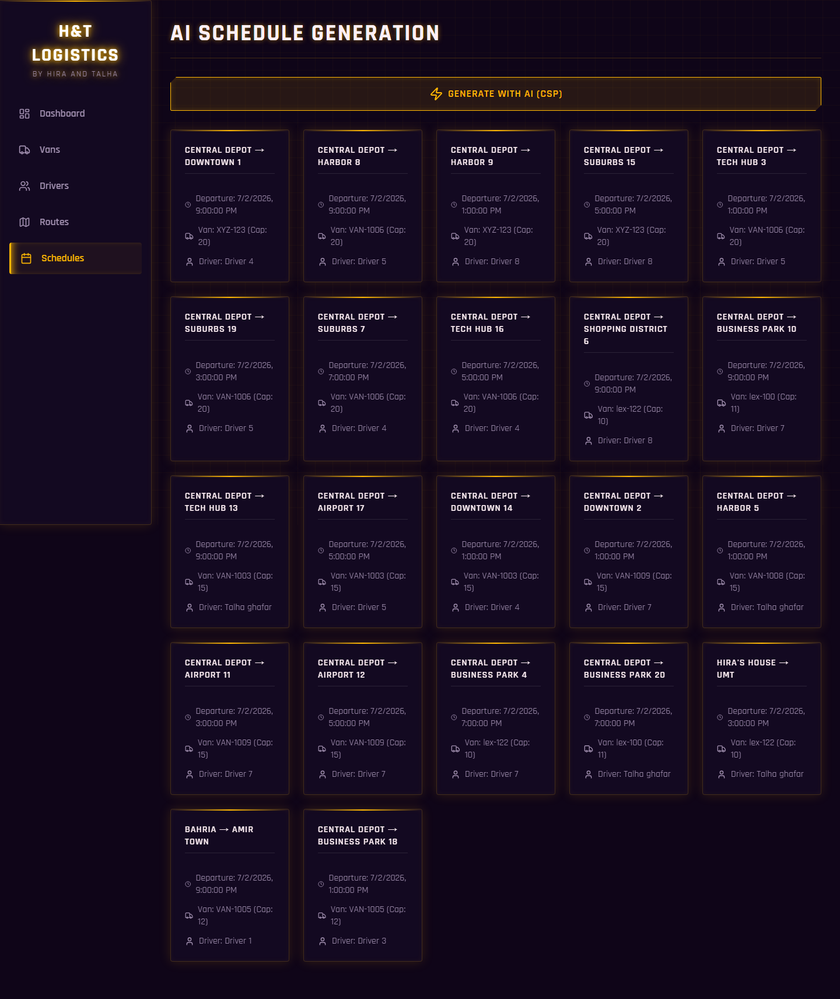

# Smart Logistics AI Scheduler

Welcome to the **Smart Logistics AI Scheduler**! This is an AI-powered logistics scheduling web application designed to automate and optimize the assignment of vans and drivers to specific routes using Constraint Satisfaction Problem (CSP) algorithms.

## Purpose
The primary purpose of this project is to eliminate manual scheduling conflicts, reduce human error, and optimize logistics operations through intelligent constraint solving and resource management.

## Goals
- Automate van and driver assignments.
- Ensure 100% compliance with operational constraints (working hours, vehicle capacity, maintenance).
- Provide a responsive, premium, and intuitive user interface for logistics administrators.
- Offer actionable analytics and real-time dashboard reporting.

## Features
- **AI Scheduling Engine:** Uses CSP (Backtracking, Forward Checking, MRV, LCV) to generate conflict-free schedules.
- **Van Management (CRUD):** Manage vehicles, capacities, fuel ranges, and maintenance status.
- **Driver Management (CRUD):** Track driver availability, licensing, and maximum daily working hours.
- **Route Management (CRUD):** Define routes with specific distances, passenger loads, time estimates, and priorities.
- **Analytics Dashboard:** Visualize vehicle usage, driver workload, and overall system status with Recharts.
- **Modern SaaS UI:** Features a dark theme with glassmorphism effects and Framer Motion-powered smooth animations.


## Project Architecture
The system uses a **decoupled architecture**: a **Django REST Framework** API backend serving a standalone **React 19 (Vite)** single-page frontend that consumes it over HTTP.
- **Frontend (SPA):** React 19 + Vite single-page app with client-side routing (React Router), calling the REST API via `fetch` (`frontend/src/api.js`).
- **Backend (REST API):** Django REST Framework `ViewSet`s and a `DefaultRouter` expose RESTful CRUD endpoints under `/api/`, with CORS enabled (`django-cors-headers`) for the decoupled frontend origin.
- **AI Engine (Services):** A decoupled module (`logistics/services/csp/solver.py`) that applies CSP logic over the Django ORM QuerySets, independent of the web/API layer.

---

## Technology Stack

### Frontend
- **Framework:** React 19 (JSX)
- **Build Tool:** Vite
- **Routing:** React Router
- **Charts:** Recharts
- **Animations:** Framer Motion
- **Icons:** Lucide React
- **Styling:** Custom CSS (dark theme + glassmorphism)
- **Linting:** oxlint

### Backend
- **Language:** Python 3.11+
- **Framework:** Django 5.x + Django REST Framework
- **API:** RESTful endpoints (ViewSets + DefaultRouter), CORS via django-cors-headers
- **AI Engine:** Custom CSP solver (Backtracking, Forward Checking, MRV, LCV)

### Database
- **Engine:** SQLite3 (Default for development)
- **ORM:** Django ORM

---

## Software Requirements

### Operating System
- Windows / macOS / Linux

### Required Software
- **Python Version:** 3.10 or higher
- **Package Manager:** pip (comes with Python)
- **Git:** For version control and cloning
- **Browser:** Modern web browser (Chrome, Firefox, Edge, Safari)

---

## Installation & Setup

We have made running this project incredibly simple through an automated batch script.

### Step 1: Clone repository
```bash
git clone https://github.com/talha-ghaffar-ch/smart-logistics-ai-scheduler.git
```

### Step 2: Navigate into project
```bash
cd smart-logistics-ai-scheduler
```

### Step 3: Run the Application
You can start the application either by double-clicking or through the command line:

**Method A: Graphical (Easiest)**
Simply double-click the **`start.bat`** file in the project folder!

**Method B: Command Prompt / PowerShell**
```bash
.\start.bat
```

The script will automatically:
1. Install all required Python and Node.js dependencies
2. Apply database migrations
3. Boot up the AI Backend Server
4. Boot up the React Frontend Server and open your browser

*(Note: Ensure you have Python and Node.js installed on your system).*

## Troubleshooting

- **Python errors (ModuleNotFoundError):**
  Ensure your virtual environment is activated before running the server. Run `pip install django`.
- **Database errors (no such table):**
  You forgot to migrate. Run `python manage.py makemigrations` followed by `python manage.py migrate`.
- **Port already in use (Error: That port is already in use.):**
  Another process is using port 8000. Stop it or run the server on a different port: `python manage.py runserver 8001`.
- **Permission denied (Windows Scripts):**
  Running scripts is disabled on your system. Run `Set-ExecutionPolicy -Scope CurrentUser -ExecutionPolicy Unrestricted` in PowerShell as Administrator.

---

## Screenshots


*Dashboard showing analytics and KPIs*


*Managing Vans with glassmorphism UI*


*AI Constraint Satisfaction Engine outputs*

---

## FAQ

**What is CSP?**
Constraint Satisfaction Problem — an AI methodology that finds valid solutions by applying a set of strict logical rules and constraints.

---

**Is Node.js required?**
Yes. Node.js is required to run the React/Vite frontend. Download it from [nodejs.org](https://nodejs.org).

---

**Can I use PostgreSQL instead of SQLite?**
Yes. Update the `DATABASES` setting in `core/settings.py` and install `psycopg2`.

---

**How do I add a new Van, Driver, or Route?**
Navigate to the respective tab from the sidebar and click the **"Add"** button on the top right.

---

**How does the AI optimize schedules?**
The CSP engine sorts domains to minimize distance and fuel ratio, prioritizes earlier departures, and uses backtracking to guarantee conflict-free assignments.

---

**What happens if a driver exceeds their maximum working hours?**
The CSP engine automatically rejects that assignment and backtracks to find a valid alternative.

---

**What if no valid schedule exists?**
The AI will notify you that no valid assignment can be found under the current constraints. Try adjusting driver hours or adding more vans/drivers.

---

**Where is the AI logic stored?**
In `logistics/services/csp/solver.py`.

---

**Where are the database models?**
In `logistics/models.py`.

---

**Is this project open-source?**
Yes, it is released under the MIT License. Feel free to fork and build on it.

---

## License
MIT License. See `LICENSE` file for more details.

---

## Contributing
1. Fork the repository.
2. Create a new branch (`git checkout -b feature/awesome-feature`).
3. Commit your changes (`git commit -m 'Add awesome feature'`).
4. Push to the branch (`git push origin feature/awesome-feature`).
5. Open a Pull Request.

---

## Developers & Contributors
Developed by **Hira** and **Talha**.

- **Hira**: [LinkedIn Profile](https://www.linkedin.com/in/hira-ali-1239b7320/)
- **Talha**: [LinkedIn Profile](https://www.linkedin.com/in/talha-ghaffar/)
